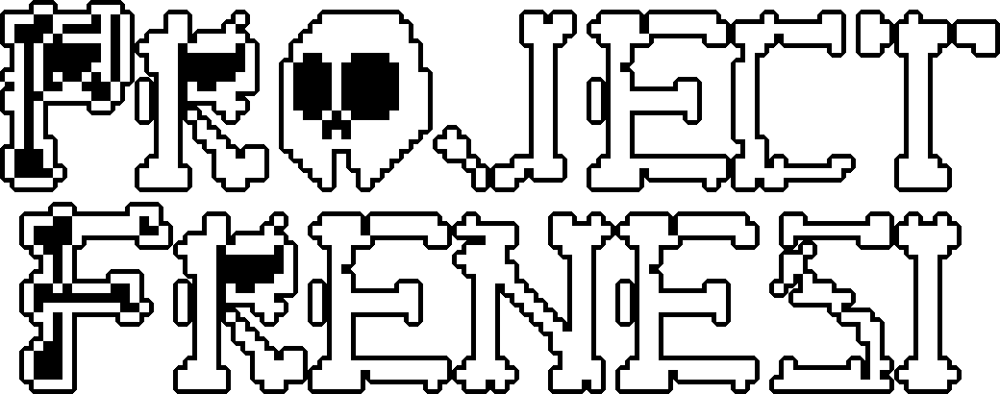
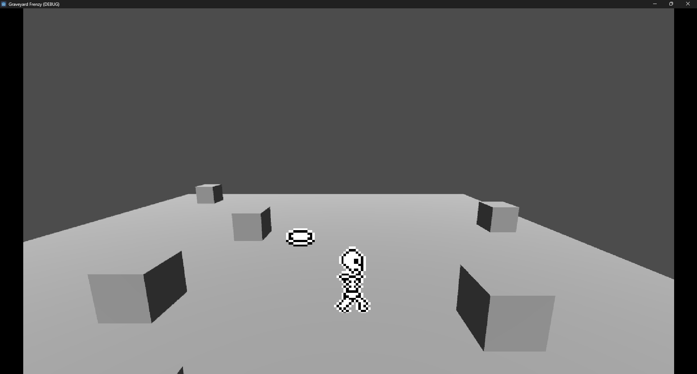
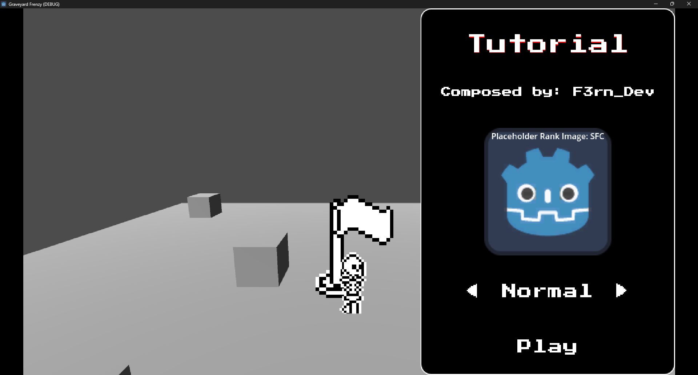
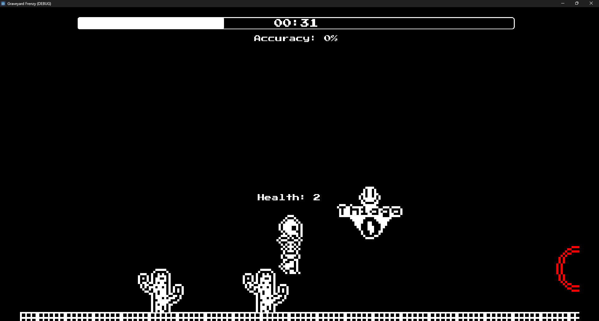

# Graveyard Frenzy

#### `A rhythm game about skeletons 💀`
***

## About
Graveyard Frenzy is a rhythm game based on Muse Dash, Friday Night Funkin' and OSU!Mania. It was first developed as a college project, in which we had to make a GCD (Game Concept Document) using a random name generator. The name we got was "Frenesi do Cemitério Mundial" (World cemetery frenzy in English).

The prototype version was made using HaxeFlixel and its repository can be found [here](https://github.com/F3rnDev/Frenesi-do-Cemiterio-Mundial)

You can read the documentation of this project [here]() <!-- WHEN YOU MAKE IT PUBLIC REMEMBER TO ADD THE LINK-->

## Project Status

 

We're still in a prototype phase, but we're working hard to make it a full game. <!-- If you're interested in seeing the progress, you can check our roadmap [here](). --> <!-- Add roadmap in documantation-->

## Screenshots

## Credits
- [F3rn](https://github.com/F3rnDev) - Main Developer