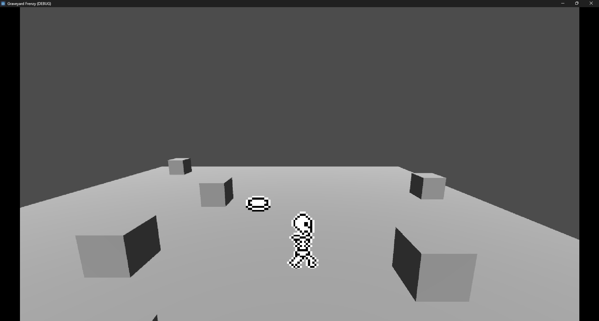
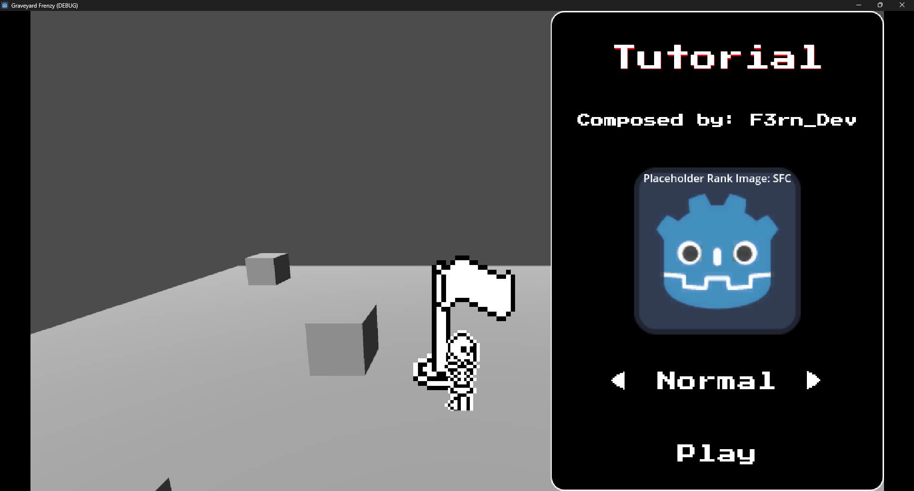
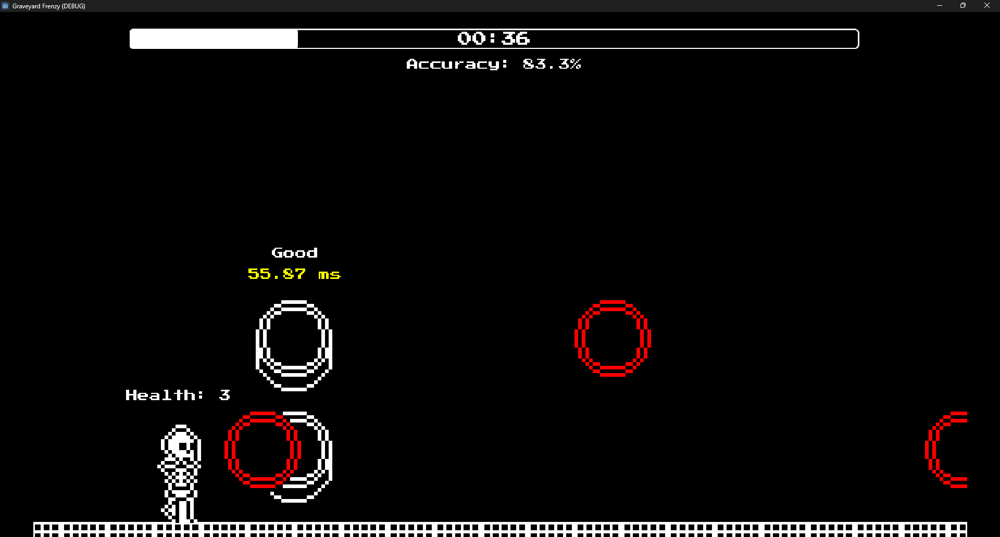
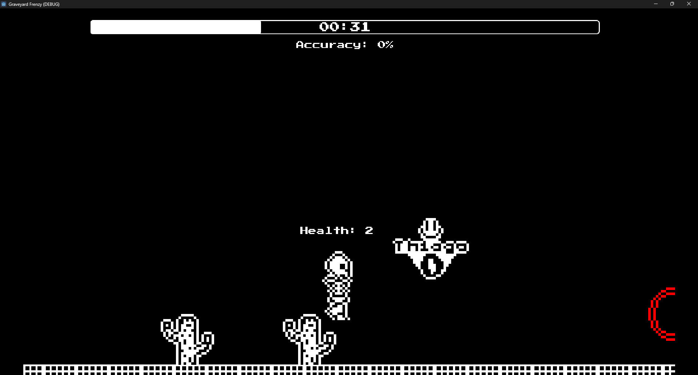

# Graveyard Frenzy

<blockquote>A rhythm game about skeletons 💀</blockquote>

<!-- Read the documentation [here]() WHEN YOU MAKE IT PUBLIC-->

## About
Graveyard Frenzy is a rhythm game based on Muse Dash, Friday Night Funkin' and OSU!Mania. It was first developed as a college project, in which we had to make a GCD (Game Concept Document) using a random name generator. The name we got was "Frenesi do Cemitério Mundial" (World cemetery frenzy in English).

The prototype version was made using HaxeFlixel and its repository can be found [here](https://github.com/F3rnDev/Frenesi-do-Cemiterio-Mundial)

## Screenshots

